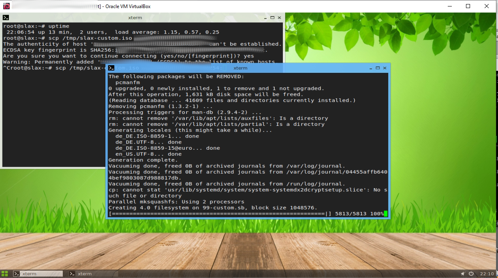

# POST-Printing

## Description:

A batte-tested printserver to print with

* *evolis primacy* for Cards
* *brother label printers* ( tested with `ql720nw` and `ql810w` )

## Features

* supports  printing from `1`-`16` print stations to 1-16 `CARD` and/or `LABEL` printers via POST-Requests

* provides the skeleton for a debian-based slax live cd ( tftp network bootable ) under `client_live_os` fetauring:
   * desktop-notifications of printer events and routing changes for the currently assigned printer
   * fullscreen kino mode `ungoogled-chrome` with a startpage loaded from printserver
   * keymap setting from kernel command line ( e.g. `tftp` )
   * display resolution setting from kernel command line ( e.g. `tftp` ) with *fallback to highest resolution available*
   * automatic keymap setting ( also on plugging new devices)
   * sound notification on plugging usb devices
   * activation of *tap-to-click* for touchpads
   * isolated user session
   * automatic `authorized_keys` placement for users root and ssh from printserver webroot
   * randomly changed root and guest passwords on startup ( sent to server in debug mode)

* can be used to print with "real" OR self-issued certificates ( e.g. `XHR`/`POST` out of web apps will  work )
* auto-detects longest edge and rotates given PDF's properly
* provides a management page that features:
   * `.htaccess` protection ( printadmin/eventadmin on the `/setup` route , see below )
   * printer state ( OK ,FAILING )
   * routing printer from client N to client M in maintenance phases
   * rotation / medium type setting per evolis primacy printer
   * activation of debug mode
   * test-print pages

* includes a `print-dummy.php` that returns the pdf to check of you send correct data


```
curl --header "Content-Type: application/json"   --request POST   --data '{"client": 1,"type":"receipt","file":"ASimpleText\nAndANewLine\nAndTheAnd"}'   http://localhost/print.php

```

## Usage

* after setting up your SSL certificates , send POST requests to `/print.php`

* `/print.php`
   * accepts the following fields:
      * `client` => $client , (integer between 1 and 16)
      * `type` => 'label' OR 'card' OR 'receipt'
      * `file` => base64 encoded PDF ( or raw text on `type=receipt` )
   * accepts `Content-type`:
       * `application/x-www-form-urlencoded`
       * 'application/json'
   * accepts JSON text to print receipts

* examples are in `tests/` folder,

  * `post-send-card.php` -> sends a test pdf ( you might try `post-send-card.php  card.pdf` )
  * `post-send-card.php` -> sends a test pdf ( you might try `post-send-label.php label.pdf` )
  * `send_json.sh` -> the aforementioned curl request to print raw text via label printers

* for evolis: first PDF site is front , second is back side

* to access the /setup pages , you need to login with the user eventadmin or printadmin , their passwords are autogenerated during setup and resettable( and will be printed to command line ) via `/usr/bin/reset-pass-printadmin.sh` and `/usr/bin/reset-pass-eventadmin.sh`

* to make the server keep the last printed files and enable request-logging , first open the "start debug" page ( which will redirect you to debug page), then print( either via a real client or the test page) and wait for the debug page to reload  ( or reload it manually)

* every client is remote accessible via ssh , the "authorized_keys" file is taken from printserver.local webroot and deployed for user guest and root

* if debug mode is enabled , live-operating-system clients also push the root and guest password to the server via `/sys-init.php`, the server saves them under `/dev/shm/client_token/`, there is also a script `/etc/connect-to-print-client.sh`  which prints the passwords and starts a ssh connection to the `guest@192.168.88.$clientnum` account ( clientnum is the first argument)

## installing ( best in byobu|screen|tmux .. )

### Server side

*  make sure your DNS "printserver.local" points to printserver IP
*  deploy SSL certificates and reload nginx( if you need REAL certificates)
*  deploy standard ubuntu22.04 (we used mini iso/tftp)

   ```
   sudo apt-get install git
   git clone https://github.com/benchonaut/POST-Printing.git
   cd POST-Printing/install
   sudo bash 0_install.sh;sudo reboot
   ```
### guest operation systems
* Server side:
   * run `bash server-side-preparation.sh` in `client_live_os` as `root` (e.g. `cd client_live_os;sudo bash server-side-preparation.sh`)
   * if you have some custom client root with some files , give your root folder as first argument to `server-side-preparation.sh`, (e.g. `cd client_live_os;sudo bash server-side-preparation.sh /home/anotheruser/path/to/client/root`)
   * setup a tftp boot server ( and setup your network to use it)
   * unpack the `boot` directory to your tftp root
   * the clients will load `http://printserver.local:80/slax-custom.iso` and boot ( follow the client step first)
* client side:
  * start a slax debian iso (also possible in VM)
  * run the script with e.g.( adjust your keymap in setxkbmap line and change 254.254.254.254 to your lan DNS server ( or the printserver if there is e.g. dnsmasq running))
    ```
    HISTFILE=/dev/null bash
    setxkbmap de
    wget -O- printserver.local/livecd-setup.sh|bash /dev/stdin     
    ```


## Screenshots

## Pages

* Start-Page Setup
    
* Test-Printing
  
* Debug Site
   
* Eventlog
   
## Client
* Desktop Notifications
   
* Generation of live-cd-iso via `livecd-setup.sh`
   

---

### TREE ( may change ) :

```
.
├── client_live_os
│   ├── livecd-seed
│   │   ├── etc
│   │   │   ├── fix-mouse-key.sh
│   │   │   ├── get-printer-status-OLD.sh
│   │   │   ├── get-printer-status.sh
│   │   │   ├── issue
│   │   │   ├── rc.local.real
│   │   │   └── wait-for-ping.sh
│   │   ├── home
│   │   │   └── guest
│   │   │       └── x-session.sh
│   │   ├── root
│   │   └── usr
│   │       └── share
│   │           └── wallpapers
│   │               └── slax_wallpaper.jpg
│   ├── livecd-setup.sh
│   └── server-side-preparation.sh
├── _COMMIT_HISTORY.log
├── git_reset.sh
├── install
│   ├── 0_1_default-branding.sh
│   ├── 0_install.sh
│   ├── 99_dummy-printers.cups-pdf.sh
│   ├── 99_dummy-printers.custompdf.sh
│   ├── 99_dummy-printers.file.sh
│   ├── assets
│   │   ├── avahi-daemon.conf
│   │   ├── favicon.tgz
│   │   └── supervisor-cups-notification.ini
│   ├── brother_ql
│   ├── client-side
│   │   └── get-printer-status.sh
│   ├── drivers
│   │   ├── brother_lpdwrapper_ql720nw
│   │   ├── CARD01.ppd.base64
│   │   ├── CARD01.ppd.O.base64
│   │   ├── evolis-primacyE.ppd.gz
│   │   ├── evorasterizer
│   │   ├── LABEL01.ppd.base64
│   │   ├── LABEL01.ppd.O.base64
│   │   ├── ql720nwcupswrapper-1.1.4-0.i386.deb
│   │   ├── ql720nwlpr-1.1.4-0.i386.deb
│   │   ├── ql720nw.tgz
│   │   ├── stamp.card
│   │   ├── stamp.header
│   │   └── stamp.label
│   ├── nginx-config
│   │   └── default
│   ├── scripts
│   │   ├── connect-to-print-client.sh
│   │   ├── extip.sh
│   │   ├── printer_clean_tmp.sh
│   │   ├── printer_status.sh
│   │   └── run.cups.notify.sh
│   ├── webroot
│   │   ├── html
│   │   │   ├── cups-get-id.php
│   │   │   ├── debug-active.php
│   │   │   ├── event.php
│   │   │   ├── extip.php
│   │   │   ├── img
│   │   │   │   └── Caret_down_font_awesome_whitevariation.svg
│   │   │   ├── index.html
│   │   │   ├── lib
│   │   │   │   └── pdf.js
│   │   │   │       ├── build
│   │   │   │       │   ├── pdf.js
│   │   │   │       │   ├── pdf.js.map
│   │   │   │       │   ├── pdf.sandbox.js
│   │   │   │       │   ├── pdf.sandbox.js.map
│   │   │   │       │   ├── pdf.worker.js
│   │   │   │       │   └── pdf.worker.js.map
│   │   │   │       └── LICENSE
│   │   │   ├── printer-status.php
│   │   │   ├── print.php
│   │   │   ├── route-status.php
│   │   │   ├── setup
│   │   │   │   ├── debug-fileget.php
│   │   │   │   ├── router.php
│   │   │   │   ├── select-arrows.svg
│   │   │   │   ├── seturl.php
│   │   │   │   ├── show-debug.php
│   │   │   │   ├── showlog.php
│   │   │   │   ├── start-debug.php
│   │   │   │   └── test-print.php
│   │   │   ├── starturl-not-set.html
│   │   │   ├── status.json.php
│   │   │   └── sys-init.php
│   │   └── printserver-functions.php
│   └── wordlist
│       ├── gen.sh
│       └── words.list
├── README.md
├── screenshots
│   ├── cd-gen.png
│   ├── client_notification.png
│   ├── debug.png
│   ├── eventlog.png
│   ├── starturl.png
│   └── test-print.png
└── tests
    ├── card-2side_merged.xcf.tgz
    ├── card.pdf
    ├── card-portrait-2side_merged.xcf.tgz
    ├── card-portrait.pdf
    ├── card-portrait.xcf
    ├── card.xcf
    ├── in_progress
    │   ├── post-send-card-curl.sh
    │   └── post-send-label-curl.sh
    ├── label.pdf
    ├── label.xcf
    ├── pagesize_pdfinfo.php
    ├── post-send-card.php
    ├── post-send-label.php
    ├── print-dummy.php
    ├── send-json.sh
    └── show-results.php

27 directories, 93 files
```
